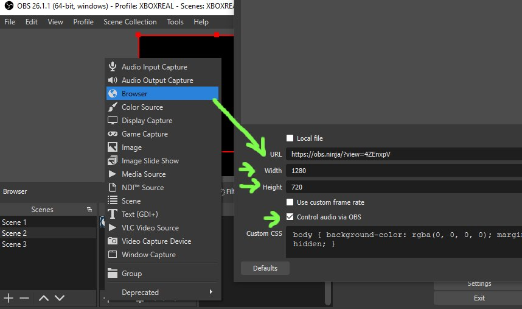

# VDO.Ninja basics

VDO.Ninja needs two thinks to work:

* Someone pushing a video feed out from their device
* Someone viewing that video feed

1. Visit [https://vdo.ninja/](https://vdo.ninja/) with your web browser (Chrome, Edge, Safari)
2. Click `Add your camera to OBS`
3. Select your camera and audio device from the list of devices\
   You will see the video feed of the device on screen, and at the top of the screen a ‘view’ link
4. Copy this view link and send it to someone you want to have access to this feed, or place it inside a OBS browser source.

.png>)

### Powered by WebRTC

[WebRTC](https://webrtc.org/)[1](broken-reference) is the magic behind VDO.Ninja. While the magic sauce is so much more than that, WebRTC powers the engine. This way VDO.Ninja works everywhere there is a modern browser. MS Edge, Google Chrome, Mozilla Firefox, Safari, Opera, Vivaldi, Brave. You name it.

VDO.Ninja is a peer-to-peer system. This means for each new person viewing your feed, a new encode is processed. It also is CPU bound since encoding usually takes place on the CPU. Take care not to overload your system. Keep an eye on your CPU usage.
